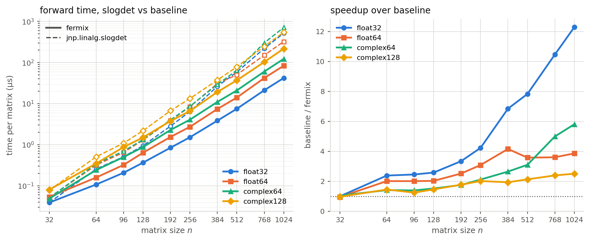
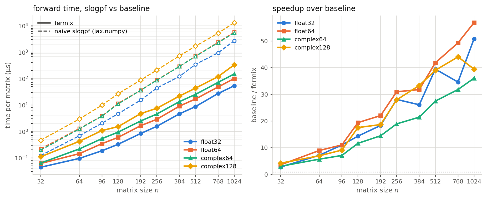

<h1 align='center'>fermix</h1>

<p align="center">
  <strong>Fast batched determinant/Pfaffian in JAX</strong>
</p>

Fermix supports `slogdet` / `slogpf` / `det` / `pf` for float32, float64, complex64, and complex128 matrices on NVIDIA GPUs, written in JAX with Pallas (Triton) kernels. The codes are generated by Claude Code.

Designed for quantum Monte Carlo in fermionic systems: a large batch of moderate-size matrices (n ~ 64-1024), forward and backward.

## Install

```bash
pip install -e .          # needs a CUDA build of jax >= 0.7.1
pytest                    # on a CUDA GPU this tests the kernels, elsewhere the fallback
```

## Usage

```python
import jax, jax.numpy as jnp
from fermix import slogdet, slogpf, det, pf

A = jax.random.normal(jax.random.key(0), (4096, 128, 128), jnp.float32)
sign, logabs = slogdet(A) # like jnp.linalg.slogdet, but faster
S = A - jnp.swapaxes(A, -1, -2)
sign, logabs = slogpf(S) # Pfaffian of the skew-symmetric batch
```

All functions accept any leading batch dimensions, any n, the four dtypes float32 / float64 / complex64 / complex128
(the 64-bit ones need `jax_enable_x64`), and are `jit`/`vmap`/`grad`/`jvp` compatible. Conventions follow
`jnp.linalg.slogdet`: `sign` has the input dtype (exactly ±1 / 0 for real inputs, a unit complex number for complex
ones) and `logabs` the real dtype; for complex inputs the sign's tangent is i·Im(tr(A⁻¹dA))·sign and `jax.grad` of a
real loss returns A⁻ᵀ without conjugation, exactly as for `jnp.linalg.slogdet`. Complex skew-symmetric means Sᵀ = −S.

`slogdet`/`slogpf` guard exactly singular inputs with a **zero** gradient rather than inf/NaN, but d log|det| is
genuinely infinite there, so that value is a guard and not a derivative. `det` and `pf` are truly singular-safe: their
gradients are the adjugate / Pfaffian adjugate — polynomials in the entries — formed from one factorisation with the
smallest pivot cancelled analytically, so they stay accurate to working precision for numerically singular matrices
(a round-off-level pivot, where det · A⁻¹ formed from two factorisations is O(1) wrong) and are the correct finite
derivatives for exactly singular ones (rank n−1 / n−2: rank-1 / rank-2 gradients; lower rank: zero), in any position.
`slogpf`'s S⁻¹ and `pf`'s adjugate come from the forward's own Parlett–Reid factors, no second factorisation.

## Performance (H200, jax 0.11.1)

Forward time per matrix on one H200 against `jnp.linalg.slogdet` and a
naive batched Parlett–Reid `slogpf` written in jax.numpy (the generic fallback path).





## Notes and limits

- `slogdet` uses the generic cuSOLVER path for n ≤ 32 / 40 / 48 (float32 / float64 / complex,
  `fermix._common.Tune.lu_generic_max_n`), where it beats the kernels' five launches; same results, no warning.
- `det` and `slogpf`/`pf` use the kernels at every n (cuSOLVER's batched LU is invalid at a zero pivot, which `det`'s
  adjugate gradient needs; the generic Parlett–Reid is 3× slower even at n = 32).
- The kernels need a CUDA GPU; any other device emits a `FermixFallbackWarning` and runs a far slower generic
  jax.numpy path with the same outputs and derivative rules, and other dtypes raise `TypeError`.
- Launch parameters are chosen per architecture and dtype (`fermix._common.TUNES`), tested on A100 and H200 with
  jax 0.11.1 (the wide dtypes were tuned on the H200 and those settings are reused on Ampere).
- `prec` picks the block-GEMM algorithm — `"tf32x3"` (default for float32 / complex64: tensor cores, fp32-level
  accuracy) or `"ieee"` (exact fp32 FMA, ~5 % slower); float64 / complex128 always run IEEE fp64 and reject `"tf32x3"`.
- Complex matrices are stored as separate real and imaginary arrays (Triton has no complex type), so a complex call
  moves twice the bytes and does four real tile products per complex one.
- Memory: two (B, n, n) work buffers for the forward, about five more for the gradient.
- Compile time per shape and dtype is 3–10 s at n = 256 and ~10 s at n = 1024 (serial kernel lowering), so enable
  JAX's persistent compilation cache (`JAX_COMPILATION_CACHE_DIR`) to pay it once.
- `det`/`pf` overflow the 32-bit dtypes for large, badly scaled matrices — use `slogdet`/`slogpf` there.
- A zero row/column gives an exact zero pivot (hence the guards above), while duplicate rows give roundoff-level
  pivots: `slogdet`/`slogpf` then return correspondingly large but finite log-gradients, `det`/`pf` the accurate
  adjugate.
- `fermix._inverse.GRAD_INVERSE = "cusolver"` switches the log-derivative inverse to a cuSOLVER reference path.
